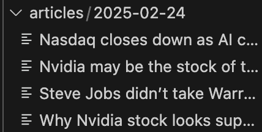

# Assignment 1
## Task 1

All the files are stored in a `csv_files` directory. 

The code is executed and moves the 3 csv files to a `backup_folder` directory.

The following screenschot shows the 3 csv files moved to the `backup_folder` directory.

## Task 2

For task 2 I used the NVIDIA stock.

NVIDIA stock saved and loaded to dataframe. 

## Task 3

I completed task 3 where I scrape news articles from yahoo finance stock market news for companies of interest. In this case that is Apple and NVIDIA and I store the title and the articles in a directory called articles which has a sub directory named after the date the article was published in.

